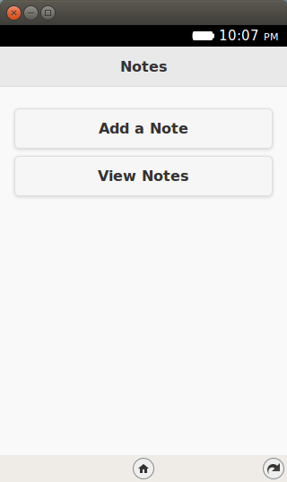
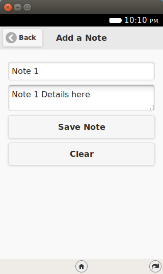
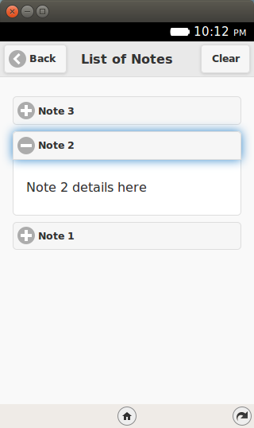
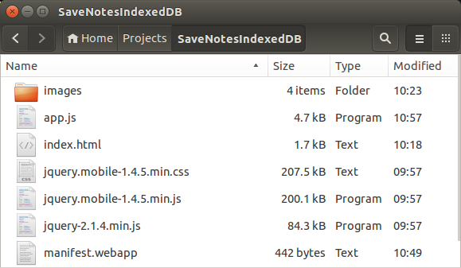

.. Copyright (C) Romin Irani. Permission is granted to copy, distribute
   and/or modify this document under the terms of the Creative Commons
   Attribution-ShareAlike 4.0 International Public License.

.. _indexedDB:

Storage using IndexedDB
=======================

Welcome to Episode 7 of the Firefox OS App Development Tutorial. In the
previous episode, we looked at how you could add persistence to your
application via the localStorage API. As the objects that you want to persist
become more complicated, you can use another HTML5 API called
`IndexedDB API <http://www.w3.org/TR/IndexedDB/>`__,
which lets you store complex objects. That's what this episode is about.

Prerequisites
-------------

* You have setup your machine with the Firefox OS Simulator. If not, you can
  check out :ref:`dev_setup`, which takes you through the entire setup.
* You have a basic understanding of writing Firefox OS Apps. If not, I
  strongly suggest refering to earlier episodes, especially :ref:`hello_world`,
  that covers how to write your first Firefox OS App.

What this Episode Covers 
------------------------

* What is the `HTML5 IndexedDB API <http://www.w3.org/TR/IndexedDB/>`__?
* Sample Firefox OS Application that covers using the HTML5 IndexedDB API. 
  We shall be extending the same Notes application that we wrote earlier. We
  will replace the localStorage API calls with the IndexedDB API calls in this
  episode.

Episode 7 in Action
-------------------

Let us check out the application in action first. The application is going to
be similar to the previous one and in terms of UI and functionality, there is
no difference.  But we will repeat it here for the sake of refreshing
everything again.

What we shall write is a mobile application that will allow us to save some
quick notes. Each note will have a title and some details. These notes will be
saved in the Indexed DB of the device and then we can view all our notes too.

All right then, the first screen of the mobile app is shown below:

When we click on the ``Add a Note`` button, we get a screen as shown below
where we can enter the title and details for the new note. Once we are done, we
can save the note by clicking on the ``Save Note`` button.

If the note is successfully saved, it will display a message as shown below:

.. image:: illustrations/episode06/save_notes3.png
   :alt: SaveNotes app with first note saved 
   :height: 350px

To view all the notes, you need to click on the ``View Notes`` button from the
main screen. This will retrieve all the notes from the Local Storage and
display them to you in a collapsible list form.

.. image:: illustrations/episode06/save_notes4.png
   :alt: SaveNotes app with list of notes 
   :height: 350px

You can click on any of the ``+`` signs and it will expand to show you the note 
details as shown below:

If you wish to delete all the notes, there is also a ``Clear`` button. This
will delete permanently all the notes from the Local Storage.

Let’s get going with the code. Note that the example screenshots are from the
Firefox OS Simulator running locally. So you can use your Firefox OS Simulator
to run all the examples.

Download Full Source Code - Episode 7
-------------------------------------

I suggest that you begin with a full download of the project source code.
Since the project depends on libraries like jQuery and jQuery Mobile, it will
save you the hassle of downloading the dependent libraries.

Download the code from: https://github.com/anicholakos/SaveNotesIndexedDB

Extract all the code in some directory. You should see a directory structure
inside of ``SaveNotes`` that looks something like this:

.. index:: IndexedDB

HTML5 IndexedDB API
-------------------

The HTML5 IndexedDB API is another JavaScript API that allows you to build
persistence in your web applications. At the end of the day, it is similar at a
high level with the localStorage API that you saw in the previous episode.

But it does have some important differences and these points will help you a
bit in evaluating which way to go.

* LocalStorage using key pairs is good for data types and objects that are
  simple in nature. Often as the objects that you persist get complicated, you
  will notice that you will have to play a lot with JSON parsing and
  stringifying. IndexedDB is meant to address that by allowing you to persist
  complex objects and even create indices on key fields to help you retrieve
  easily.
* LocalStorage API is synchronous in nature. This means that you should ensure
  that your API operations are quick, else you could end up blocking the User
  Interface. The IndexedDB API is asynchronous in nature and this means that
  you are not blocking your UI to complete the operation. You make the call and
  once it is done, the result (either onsuccess or onerror is a callback to
  your functions).
* LocalStorage API is much simpler to use than IndexedDB API and which you
  shall see in a while but several wrappers do exist that sort of abstract out
  the API complexity.
* Searching through LocalStorage API is a challenge. On the other hand, in the
  IndexedDB world, you can create indices and search on them via various
  criteria.

A few things to note about the IndexedDB API:

* The IndexedDB API allows your application to create data stores.
* Each datastore can be analogous to saving one type of data. For example,
  products, notes, or employees.
* The store contains records of data and you can define a key for your data and 
  the values. The key can be autogenerated or even user provided. The value
  will contain your object.
* You can define one or more indices on your data and that makes it easier to
  search through the data.

SaveNotesIndexedDB Application
--------------------------------

OK. Lets get going with understand the code and how the IndexedDB API has been
used to persist (save) notes in our application.

SaveNotesIndexDB Application - ``manifest.webapp``
--------------------------------------------------

.. literalinclude:: _static/episode07/manifest.webapp
   :language: javascript 
   :linenos:

SaveNotes Application - ``index.html``
--------------------------------------

Next up is the ``index.html`` page and it is a simple jQuery Mobile page.

.. literalinclude:: _static/episode07/index.html
   :language: html 
   :linenos:

Let us discuss the ``index.html`` page in detail now:

* We have included the script in the ``app.js file`` on **Line 11**.
* There are 3 pages in the mobile application:
    * ``home`` (**Lines 17-28**).
    * ``add-notes`` (**Lines 31-44**).
    * ``view-notes`` (**Lines 47-59**).
* The ``#home`` page has two buttons for ``Add a Note`` and ``View Notes``. 
* The ``#add-notes`` page has a form for entering the title (``#noteTile``),
  details (``#noteDetails``) and two buttons for saving the note
  (``#btnSaveNote``) and clearing the fields (``#btnClearNotes``).
* The ``#view-notes`` page has a button in the header to clear all notes
  (``#clearAllNotesBtn``) and it has a div area (``#note-list``) to display all
  current notes, once we get them from the Local Storage.

SaveNotesIndexedDB Application - ``app.js``
-------------------------------------------

.. literalinclude:: _static/episode07/app.js
   :language: javascript 
   :linenos:

Let us discuss the source code in detail now since it contains the HTML5
IndexedDB JavaScript API:

* First, the standard stuff. **Line 48**, the standard jQuery ``ready``
  function, is fired and the first thing that we are invoking here is a call to
  the ``initializeDB()`` function. In this function, we shall create the
  database+store and get it ready for other operations.
* In **line 2** we define our ``db`` variable that will hold the connection to
  the database that we shall use subsequently when we add records, delete
  records, search for records, etc.
* The ``initializeDB()`` function is defined in **lines 4-46**.
* We check first for IndexedDB support by checking the property ``indexedDB``
  in the ``window`` object. This will typically not be needed since the support
  is there, but I am just showing you this in case you want to introduce this
  code to other browsers via your desktop web applications too. Keep in mind
  that this is an evolving standard and support is not fully there across all
  browsers. For FirefoxOS, you can rest assured that support is present.
* On **line 13** we open our database. We are naming the database ``notesdb``
  and providing a version of the database -- ``1`` in this case. Keep in mind
  that the IndexedDB API is an asynchronous API, so we are defined two
  callbacks: onsuccess and onerror. In ``onsuccess``, we initialize the db
  variable to the database that we just opened.
* Great. Now that we have the connection to the database, we need to create the 
  initial object store. Think of creating the initial tables. For this we need
  the ``onupgradeneeded`` callback that is defined on **line 29**. This
  function is only called when a version change occurs. We had passed the
  version 1 earlier and since there is no database present, it will get invoked
  the first time and we can then create our data stores here. If you ever want
  to change the schema or modify the store, you should change the version
  number in your upgraded version of the app when you open the database as
  shown on **line 15**.
* On **line 41**, we are creating our Object Store named ``notes``. Keep in
  mind that we can create more object stores but since we are just dealing with
  notes here, I am creating only one. Apart from the first parameter which is
  the store name, the second parameter is the key field for your object. We are
  defining it as an auto-increment field with the key name as ID.
* This completes our initialization of the database. To summarize we opened the 
  connection to the database (notesdb) and created one object store (notes).
  The notes that we create in the application will be saved in the notes
  datastore.
* Let us now focus on adding or aaving the note. Look at **lines 86–114**.
  Here you will notice that we first extract out the value that the user has
  entered for ``title`` and ``detail``. Then on **line 100**, we first create a
  **transaction** object from the **database**. To create the transaction, you
  can provide a list of datastore names (in our case it is just one i.e.
  ``notes``) and the transaction mode like read or readwrite. Since we
  want to write a new record, we are using the readwrite mode.
* On **line 95**, we are creating the standard Notes object. We store the
  attributes for title and details.
* Now within the transaction context, we obtain the store that we want to work
  with on **line ??** and then add the object to it. We use the onsuccess and
  onerror callbacks as needed.
* Now let us focus on **lines ??-??**. **Lines ??–??** indicate that when we
  press the ``View Notes`` button on the index page, it will navigate to the
  ``view-notes`` page.
* We clear the content i.e. any existing items that were present on the page
  by clearing the HTML content for ``#note-list`` on **line ??**.
* Then once again we obtain the transaction object from the database. This
  time we pass only the list of datastore names (in our case just ``notes``).
  If you do not provide the second parameter i.e. ``transaction mode``, it
  means that it is **read mode**. We then object the store from the transaction
  context on **line ??**. 
* Next we use a cursor to iterate through each of the notes object and build
  out the notes HTMLElement that we shall create for each note. Notice the use
  of ``cursor.continue()`` on **line ??** to move to the next record.
* Then for each note, we are simply creating a collapsible div for jQuery
  Mobile UI and appending it to the ``#note-list`` element.
* Clearing (Deleting) all the notes is also straightforward. Refer to
  **lines ??–??**. The pattern of usage is the same. Get the transaction. Get
  the store. And then call the ``clear()`` function on the store.

Next Steps
----------

I encourage you to learn more about the IndexedDB API. Mozilla covers this in a
lot more detail on a page on the MDN named `Using Indexed DB
<https://developer.mozilla.org/en-US/docs/Web/API/IndexedDB_API/Using_IndexedDB>`__.
A good exercise to try out would be to come up with your own little database
design. Come up with a DB and some data stores. Create some indices and play
around with basic CRUD Operations.
